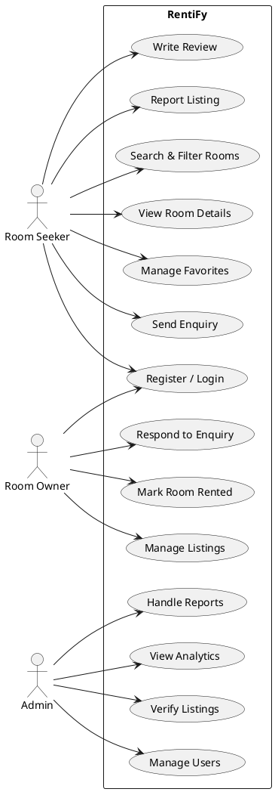
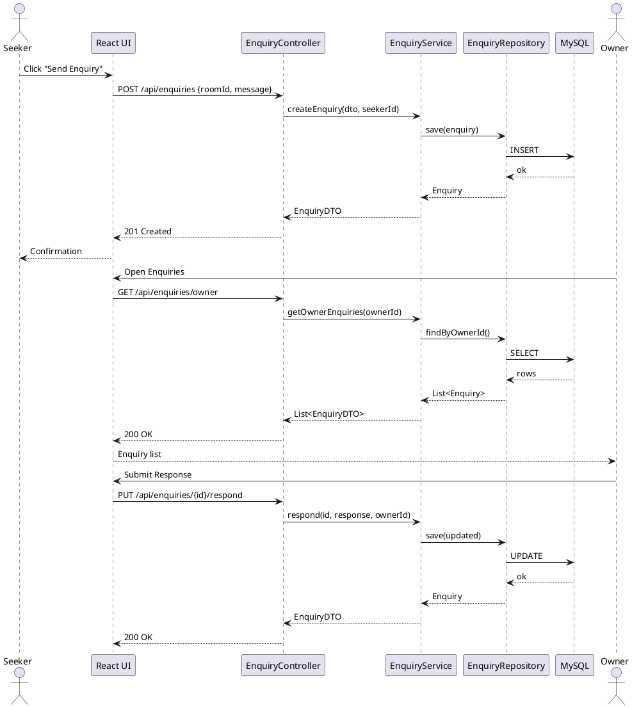
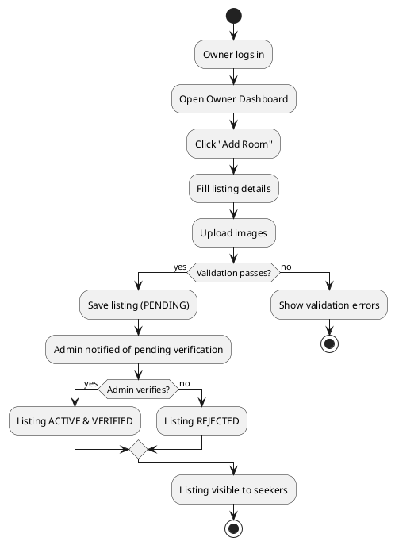
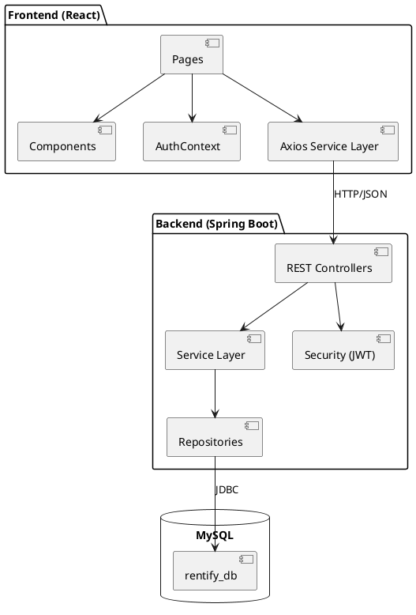
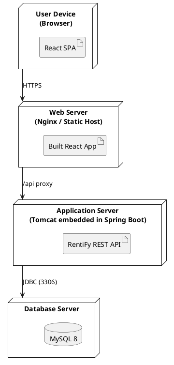

# RentiFy – Room Rental Platform
## Product Requirements Document (PRD)

| Field | Value |
|---|---|
| Document Title | RentiFy – Room Rental Platform PRD |
| Version | 1.0 |
| Document Type | Product Requirements Document |
| Prepared By | Senior Product Manager / Business Analyst / Software Architect |
| Status | Approved for Development |
| Target Release | MVP v1.0 |

---

## 1. Executive Summary

RentiFy is a web-based room rental discovery and management platform designed primarily for **students and working professionals** seeking affordable rental rooms, and for **room owners/landlords** who want a direct, organized channel to list and manage their rooms.

Today, room discovery happens across WhatsApp groups, Facebook groups, local brokers, and word-of-mouth. These channels are fragmented, unsearchable, unverified, and unreliable. RentiFy centralizes the entire lifecycle — **search → discover → enquire → respond → rent → review** — into a single, role-based, secure platform built on React.js, Spring Boot, Spring Security (JWT), and MySQL.

The platform delivers three role-specific experiences:
- **Room Seeker** – search, filter, favorite, enquire, review, report.
- **Room Owner** – list, manage, respond, mark rented.
- **Admin** – verify, moderate, manage users/listings, handle reports, view analytics.

RentiFy is scoped deliberately as an **MCA-level academic project**: implementable with a 3-tier monolithic architecture, no microservices, no AI/ML, no blockchain, and no complex payment gateway in the MVP.

---

## 2. Problem Statement

| # | Problem | Impact |
|---|---|---|
| P1 | Room listings are scattered across WhatsApp/Facebook groups | No single source of truth; high search time |
| P2 | No structured filtering (rent, locality, gender, furnishing) | Users sift through irrelevant posts manually |
| P3 | Broker dependency and brokerage fees | Financial burden on students |
| P4 | Fake, stale, or duplicate listings | Wasted visits, trust erosion, fraud risk |
| P5 | No verification of owners or listings | Safety concerns, especially for women |
| P6 | Communication is unstructured (calls, DMs) | Lost context, no enquiry tracking |
| P7 | Owners cannot manage availability or mark rooms rented | Repeated calls for already-rented rooms |
| P8 | No reviews or accountability | No feedback loop on owners/listings |

**Problem Statement (formal):** There is no centralized, structured, searchable, and trustworthy platform for students and working professionals to discover affordable rental rooms and for owners to manage listings and enquiries efficiently.

---

## 3. Proposed Solution

RentiFy provides:

1. **Centralized room discovery** with structured listings and multi-criteria filtering.
2. **Role-based dashboards** for Seekers, Owners, and Admins.
3. **Structured enquiry system** replacing unstructured calls/DMs, with status tracking (Pending → Responded → Closed).
4. **Owner listing management** — create, edit, upload images, update availability, mark rented, delete.
5. **Trust layer** — listing verification, user verification, reviews/ratings, and reporting.
6. **Admin moderation** — manage users, verify listings, handle reports, view analytics.
7. **Secure access** — JWT-based authentication with role-based authorization.

---

## 4. Project Objectives

| ID | Objective | Success Indicator |
|---|---|---|
| O1 | Centralize room listings | ≥ 90% of listings have complete structured data |
| O2 | Reduce search time | User finds a relevant room in ≤ 3 filter operations |
| O3 | Eliminate broker dependency | Direct seeker↔owner enquiry channel |
| O4 | Ensure listing freshness | Owner can mark Rented / Temporarily Unavailable |
| O5 | Build trust | Verification status + reviews visible on every listing |
| O6 | Provide moderation | Admin resolves reports within platform workflow |
| O7 | Deliver a clean, responsive UI | Works on desktop, tablet, mobile |

---

## 5. Target Users

| User Group | Description | Primary Need |
|---|---|---|
| Students | College/university students, often sharing rooms, budget-sensitive | Cheap, nearby, gender-safe rooms |
| Working Professionals | Freshers/early-career employees relocating | Furnished rooms, short notice, locality-based |
| Room Owners / Landlords | Individuals or PG operators renting rooms | Fast, low-effort listing + genuine enquiries |
| Administrators | Platform operators | Control, moderation, visibility |

---

## 6. User Personas

### Persona A — Student / Room Seeker

| Attribute | Detail |
|---|---|
| Name | Aarav, 21 |
| Role | Final-year B.Tech student |
| Location | Pune |
| Budget | ₹4,000 – ₹7,000 / month |
| Device | Mobile browser |
| Goals | Find a cheap room near college, preferably with a roommate, no broker |
| Pain Points | WhatsApp groups are noisy; brokers charge one month's rent; listings are stale |
| Expected Behavior | Searches frequently, filters by locality + max rent + gender, saves favorites, sends 3–5 enquiries |
| Required Features | Search, filters, room details, favorites, enquiry, owner response, review, report |
| User Journey | Register → Login → Search "Pune / Kothrud" → Filter rent ≤ ₹7,000 + Gender: Male → View room → Favorite → Send enquiry → Receive response → Visit → Review |

### Persona B — Working Professional / Room Seeker

| Attribute | Detail |
|---|---|
| Name | Sneha, 25 |
| Role | Software Engineer, recently relocated |
| Location | Bengaluru |
| Budget | ₹10,000 – ₹18,000 / month |
| Device | Desktop + mobile |
| Goals | Fully furnished, safe, female-only PG near office, move-in within 2 weeks |
| Pain Points | Unverified owners; no way to compare; wasted site visits |
| Expected Behavior | Uses advanced filters (furnishing, room type, availability date), shortlists via favorites, enquires to 3 owners in parallel |
| Required Features | Filters, sorting, availability date, verified badge, enquiry tracking, reviews |
| User Journey | Register → Login → Filter: City=Bengaluru, Furnishing=Fully, Gender=Female, Type=PG → Sort by Newest → View details → Check verification → Send enquiry → Track status → Review after move-in |

### Persona C — Room Owner / Landlord

| Attribute | Detail |
|---|---|
| Name | Mr. Rao, 48 |
| Role | Owner of a 3-room PG |
| Location | Hyderabad |
| Goals | Fill vacancies fast, avoid broker fees, receive only genuine enquiries |
| Pain Points | Gets 20 calls/day for an already-rented room; no way to publish details once |
| Expected Behavior | Lists rooms once with photos, responds to enquiries from dashboard, marks rented when filled |
| Required Features | Add/edit/delete listing, image upload, availability toggle, enquiry inbox, respond, mark rented, listing status |
| User Journey | Register as Owner → Login → Dashboard → Add Room → Upload images → Set rent/location/gender/furnishing → Publish → Receive enquiry → Respond → Mark Rented |

### Persona D — Platform Administrator

| Attribute | Detail |
|---|---|
| Name | Priya, 30 |
| Role | Platform Admin / Moderator |
| Goals | Keep listings genuine, remove fraud, monitor platform health |
| Pain Points | No visibility into reports or verification backlog |
| Expected Behavior | Reviews dashboard daily, verifies listings, resolves reports, disables suspicious users |
| Required Features | Admin dashboard, user management, listing management, verification, reports, analytics |
| User Journey | Admin Login → Dashboard → Review pending verifications → Approve/Reject → Handle open reports → Remove listing → View analytics |

---

## 7. User Roles

| Role | Code | Description | Access Boundary |
|---|---|---|---|
| Room Seeker | `ROLE_SEEKER` | Searches and enquires about rooms | Public listings, own favorites/enquiries/reviews |
| Room Owner | `ROLE_OWNER` | Publishes and manages listings | Own listings + enquiries on own listings |
| Administrator | `ROLE_ADMIN` | Moderates the platform | All users, listings, reports, analytics |

### Role 1 — Room Seeker: Features

| # | Feature |
|---|---|
| S1 | Register |
| S2 | Login |
| S3 | Logout |
| S4 | Search rooms |
| S5 | Apply filters |
| S6 | View room details |
| S7 | View room images |
| S8 | View rent, location, gender preference, furnishing, availability |
| S9 | Add room to favorites |
| S10 | Send enquiry |
| S11 | View enquiry status |
| S12 | View owner response |
| S13 | Write review |
| S14 | Report listing |

### Role 2 — Room Owner / Landlord: Features

| # | Feature |
|---|---|
| O1 | Register |
| O2 | Login |
| O3 | Logout |
| O4 | Owner dashboard |
| O5 | Add room listing |
| O6 | Upload room images |
| O7 | Enter room details |
| O8 | Set rent, location, gender preference, furnishing status, availability |
| O9 | Publish listing |
| O10 | Edit listing |
| O11 | Delete/remove listing |
| O12 | Receive enquiries |
| O13 | Respond to enquiries |
| O14 | Update availability |
| O15 | Mark room as rented |
| O16 | View listing status |

### Role 3 — Admin: Features

| # | Feature |
|---|---|
| A1 | Admin login |
| A2 | Admin dashboard |
| A3 | Manage users |
| A4 | Verify users |
| A5 | Manage listings |
| A6 | Verify listings |
| A7 | Handle reports |
| A8 | Remove inappropriate listings |
| A9 | Remove stale listings |
| A10 | Monitor platform activity |
| A11 | View system analytics |

---

## 8. Product Scope

### In Scope (MVP)
Authentication & RBAC, user management, room listing CRUD, image upload, search & filters, room details, favorites, enquiries + owner responses, availability management, reviews & ratings, reporting, listing verification, admin dashboard, owner dashboard, seeker dashboard, basic analytics.

### Out of Scope (MVP)
Online rent payment, real-time chat, map integration, push/email notifications, mobile app, recommendation engine, subscription plans, document/KYC verification, microservices, AI/ML, blockchain, WebSockets.

---

## 9. Functional Requirements

| ID | Requirement |
|---|---|
| FR-01 | The system shall allow a user to register as Seeker or Owner. |
| FR-02 | The system shall allow registered users to log in. |
| FR-03 | The system shall allow authenticated users to log out. |
| FR-04 | The system shall provide role-based access control. |
| FR-05 | The system shall hash passwords before storage. |
| FR-06 | The system shall issue a JWT on successful login. |
| FR-07 | The system shall allow Seekers to search rooms by keyword/location. |
| FR-08 | The system shall allow filtering by city, locality, min rent, max rent. |
| FR-09 | The system shall allow filtering by gender preference. |
| FR-10 | The system shall allow filtering by furnishing status. |
| FR-11 | The system shall allow filtering by room type. |
| FR-12 | The system shall allow filtering by availability status. |
| FR-13 | The system shall support combining multiple filters. |
| FR-14 | The system shall support sorting (lowest rent, highest rent, newest, relevance). |
| FR-15 | The system shall support pagination of search results. |
| FR-16 | The system shall allow Seekers to view full room details. |
| FR-17 | The system shall allow Owners to create a room listing. |
| FR-18 | The system shall allow Owners to upload multiple room images. |
| FR-19 | The system shall allow Owners to edit their own listings. |
| FR-20 | The system shall allow Owners to delete their own listings. |
| FR-21 | The system shall allow Owners to update availability status. |
| FR-22 | The system shall allow Owners to mark a room as Rented. |
| FR-23 | The system shall allow Seekers to add/remove favorites. |
| FR-24 | The system shall prevent duplicate favorites. |
| FR-25 | The system shall allow Seekers to send an enquiry on a room. |
| FR-26 | The system shall allow Owners to view received enquiries. |
| FR-27 | The system shall allow Owners to respond to enquiries. |
| FR-28 | The system shall allow enquiry status updates (Pending/Responded/Closed). |
| FR-29 | The system shall allow Seekers to view enquiry status and owner responses. |
| FR-30 | The system shall allow Seekers to submit a rating (1–5) and review. |
| FR-31 | The system shall prevent duplicate reviews per user per room. |
| FR-32 | The system shall allow users to report a listing with a reason. |
| FR-33 | The system shall allow Admins to view and manage all users. |
| FR-34 | The system shall allow Admins to verify or reject listings. |
| FR-35 | The system shall allow Admins to handle reports and remove listings. |
| FR-36 | The system shall allow Admins to disable suspicious users. |
| FR-37 | The system shall provide an admin analytics dashboard. |
| FR-38 | The system shall provide Owner and Seeker dashboards. |
| FR-39 | The system shall never expose passwords or sensitive data via APIs. |
| FR-40 | The system shall return standardized error responses. |

---

## 10. Non-Functional Requirements

| ID | Category | Requirement |
|---|---|---|
| NFR-01 | Security | All authentication shall use JWT over HTTPS with BCrypt password hashing. |
| NFR-02 | Security | All protected endpoints shall enforce role-based authorization. |
| NFR-03 | Security | Sensitive config (JWT secret, DB credentials) shall be externalized via environment variables. |
| NFR-04 | Performance | Search API shall respond within 2 seconds for up to 10,000 listings. |
| NFR-05 | Performance | Page load (first contentful paint) ≤ 3 seconds on 4G. |
| NFR-06 | Scalability | Stateless API design shall permit horizontal scaling. |
| NFR-07 | Availability | Target 99% uptime during academic evaluation periods. |
| NFR-08 | Reliability | All DB write operations shall be transactional. |
| NFR-09 | Maintainability | Layered architecture (Controller→Service→Repository) shall be strictly followed. |
| NFR-10 | Usability | UI shall be navigable within 3 clicks to any core action. |
| NFR-11 | Responsiveness | UI shall be fully responsive across desktop, tablet, mobile. |
| NFR-12 | Compatibility | Support latest Chrome, Firefox, Edge, Safari. |
| NFR-13 | Data Integrity | Foreign keys and unique constraints shall be enforced at DB level. |
| NFR-14 | Code Quality | Consistent naming, DTO usage, and global exception handling. |

---

## 11. Feature Requirements (Core Modules)

### 11.1 Authentication & Authorization

| Aspect | Detail |
|---|---|
| **Purpose** | Secure identity, session establishment, and role-gated access. |
| **Functional Requirements** | Register, login, logout, JWT issuance, role assignment, password hashing, protected routes. |
| **User Actions** | Submit registration form, submit login credentials, log out, access role-specific pages. |
| **System Behavior** | Validates input → hashes password (BCrypt) → persists user with role → on login, authenticates → issues JWT → frontend stores token → attaches `Authorization: Bearer <token>` to requests. |
| **Validation** | Unique email; valid email format; password ≥ 8 chars with letter + number; role must be SEEKER or OWNER (ADMIN seeded). |
| **Error Scenarios** | Duplicate email (409), invalid credentials (401), missing token (401), insufficient role (403). |
| **Success Scenarios** | 201 on register; 200 + JWT on login; 200 on logout. |

### 11.2 User Management

| Aspect | Detail |
|---|---|
| **Purpose** | Manage user profiles and administrative user control. |
| **Functional Requirements** | View/update own profile; admin list/search/disable users; admin verify users. |
| **User Actions** | Edit profile, change phone/name; admin filters users by role/status. |
| **System Behavior** | Profile updates restricted to own record; admin actions logged. |
| **Validation** | Phone 10 digits; name 2–60 chars; email immutable after registration (or re-validated). |
| **Errors** | 404 user not found; 403 editing another user; 409 duplicate email. |
| **Success** | 200 with updated profile DTO (password excluded). |

### 11.3 Room Search

| Aspect | Detail |
|---|---|
| **Purpose** | Enable keyword/location-based discovery. |
| **Functional Requirements** | Search by keyword, city, locality; return paginated results. |
| **User Actions** | Enter keyword, submit search, paginate. |
| **System Behavior** | Case-insensitive LIKE match across title, locality, city, description. |
| **Validation** | Keyword ≤ 100 chars; page ≥ 0; size 1–50. |
| **Errors** | 400 invalid pagination params. |
| **Success** | 200 with page object. |

### 11.4 Room Filtering

| Aspect | Detail |
|---|---|
| **Purpose** | Narrow results by structured attributes. |
| **Functional Requirements** | Filters: city, locality, minRent, maxRent, genderPreference, furnishingStatus, roomType, availabilityStatus; combinable; clearable. |
| **User Actions** | Select filters, apply, clear, sort. |
| **System Behavior** | Filters combined with AND; dynamic query via JPA Specification. |
| **Validation** | minRent ≥ 0; maxRent ≥ minRent; enum values must match allowed sets. |
| **Errors** | 400 invalid filter value. |
| **Success** | 200 filtered page; empty list with 200 if no match. |

### 11.5 Room Listing Management

| Aspect | Detail |
|---|---|
| **Purpose** | Allow owners to publish and manage rooms. |
| **Functional Requirements** | Create, read, update, delete, publish/unpublish; ownership enforcement. |
| **User Actions** | Fill ListingForm, upload images, save as draft/publish, edit, delete. |
| **System Behavior** | New listings default `listingStatus = PENDING` until admin/auto approval; `verificationStatus = UNVERIFIED`. |
| **Validation** | Rent > 0; deposit ≥ 0; title 10–100 chars; description 20–2000 chars; required city/locality/type/furnishing/gender. |
| **Errors** | 403 editing others' listing; 404 not found; 400 validation failure. |
| **Success** | 201 created; 200 updated; 204 deleted (soft delete recommended). |

### 11.6 Room Image Management

| Aspect | Detail |
|---|---|
| **Purpose** | Visual representation of rooms. |
| **Functional Requirements** | Upload multiple images per room; set primary image; delete image. |
| **User Actions** | Select files, upload, reorder, delete. |
| **System Behavior** | Stored on server filesystem (`/uploads/rooms/{roomId}/`) with path in DB; max 8 images. |
| **Validation** | Formats: JPG, JPEG, PNG, WEBP; max 5 MB each. |
| **Errors** | 400 invalid format/size; 413 payload too large. |
| **Success** | 201 with image URLs. |

### 11.7 Room Details

| Aspect | Detail |
|---|---|
| **Purpose** | Complete, structured view of a room. |
| **Functional Requirements** | Display all public fields, amenities, owner public info, verification badge, reviews, action buttons. |
| **User Actions** | View, favorite, contact, enquire, report. |
| **System Behavior** | Hides owner email/phone unless revealed through enquiry; increments view count. |
| **Validation** | Room must exist and be visible. |
| **Errors** | 404 not found; 410 if removed. |
| **Success** | 200 with RoomDetailDTO. |

### 11.8 Availability Management

| Aspect | Detail |
|---|---|
| **Purpose** | Keep listings accurate. |
| **Functional Requirements** | Owner sets status: AVAILABLE, RENTED, TEMPORARILY_UNAVAILABLE; sets availableFrom date. |
| **User Actions** | Toggle availability from dashboard or listing page. |
| **System Behavior** | RENTED listings excluded from default search; availableFrom must be ≥ today. |
| **Validation** | Enum check; date not in past. |
| **Errors** | 400 invalid status/date. |
| **Success** | 200 with updated status. |

### 11.9 Favorites

| Aspect | Detail |
|---|---|
| **Purpose** | Let seekers shortlist rooms. |
| **Functional Requirements** | Add, remove, list favorites; prevent duplicates. |
| **User Actions** | Click heart icon; view Favorites page. |
| **System Behavior** | Unique constraint (user_id, room_id). |
| **Validation** | Room must exist and be visible. |
| **Errors** | 409 duplicate favorite; 404 room not found. |
| **Success** | 201 added; 204 removed; 200 list. |

### 11.10 Enquiry Management

| Aspect | Detail |
|---|---|
| **Purpose** | Structured seeker→owner communication. |
| **Functional Requirements** | Create enquiry, list seeker/owner enquiries, view detail. |
| **User Actions** | Send message from room details; view My Enquiries. |
| **System Behavior** | Enquiry created with status PENDING; owner notified via dashboard. |
| **Validation** | Message required, 10–500 chars; cannot enquire on own listing; one open enquiry per user per room. |
| **Errors** | 409 duplicate open enquiry; 400 validation; 403 own listing. |
| **Success** | 201 with enquiry DTO. |

### 11.11 Owner Response

| Aspect | Detail |
|---|---|
| **Purpose** | Enable owner replies and status closure. |
| **Functional Requirements** | Owner replies; status becomes RESPONDED; either party can CLOSE. |
| **User Actions** | Type reply, submit; close enquiry. |
| **System Behavior** | Response stored with timestamp; status transitions validated. |
| **Validation** | Reply 1–500 chars; only owner of the room may respond. |
| **Errors** | 403 unauthorized responder; 400 invalid transition. |
| **Success** | 200 with updated enquiry. |

### 11.12 Reviews & Ratings

| Aspect | Detail |
|---|---|
| **Purpose** | Build trust and accountability. |
| **Functional Requirements** | Submit rating 1–5 + comment; list reviews per room; edit/delete own review. |
| **User Actions** | Write review post-interaction; edit/delete own review. |
| **System Behavior** | Room average rating recalculated; one review per user per room. |
| **Validation** | Rating integer 1–5; comment 10–500 chars. |
| **Errors** | 409 duplicate review; 403 editing others' review. |
| **Success** | 201 created; 200 updated; 204 deleted. |

### 11.13 Reporting System

| Aspect | Detail |
|---|---|
| **Purpose** | Crowd-sourced moderation. |
| **Functional Requirements** | Report a listing with reason + optional description; admin views/resolves. |
| **User Actions** | Click Report, choose reason, submit. |
| **System Behavior** | Report created with status OPEN; admin actions change status. |
| **Validation** | Reason from enum; description ≤ 500 chars; one open report per user per room. |
| **Errors** | 409 duplicate open report; 400 invalid reason. |
| **Success** | 201 created. |

### 11.14 Admin Management

| Aspect | Detail |
|---|---|
| **Purpose** | Platform governance. |
| **Functional Requirements** | Manage users, listings, reports, verification, analytics. |
| **User Actions** | Filter, verify, reject, disable, remove, resolve. |
| **System Behavior** | All admin actions auditable (who, what, when). |
| **Validation** | Role check ROLE_ADMIN on every endpoint. |
| **Errors** | 403 non-admin; 404 target not found. |
| **Success** | 200 with action result. |

### 11.15 Listing Verification

| Aspect | Detail |
|---|---|
| **Purpose** | Distinguish trustworthy listings. |
| **Functional Requirements** | Admin sets verificationStatus: UNVERIFIED, VERIFIED, REJECTED. |
| **User Actions** | Admin reviews listing, approves or rejects with remark. |
| **System Behavior** | Verified listings display a badge and rank higher in "Most Relevant". |
| **Validation** | Rejection requires a remark. |
| **Errors** | 400 missing remark on reject. |
| **Success** | 200 with updated verification status. |

### 11.16 Analytics Dashboard

| Aspect | Detail |
|---|---|
| **Purpose** | Platform health visibility. |
| **Functional Requirements** | Counts: users, owners, seekers, listings, available, rented, pending verification, pending reports, enquiries, reviews. |
| **User Actions** | View dashboard; optionally filter by date range (nice-to-have). |
| **System Behavior** | Aggregated queries; cached if needed. |
| **Validation** | Admin-only. |
| **Errors** | 403 non-admin. |
| **Success** | 200 with metrics DTO. |

---

## 12. User Workflows

### Workflow 1 — Room Seeker
`Register → Login → Search → Filter → View Room → Favorite → Enquiry → Owner Response → Review`

| Step | Actor | Action | System Response |
|---|---|---|---|
| 1 | Seeker | Submits registration | Creates user with ROLE_SEEKER, 201 |
| 2 | Seeker | Logs in | Returns JWT, 200 |
| 3 | Seeker | Searches "Kothrud" | Returns matching listings, 200 |
| 4 | Seeker | Applies filters (rent ≤ 7000, Male, Semi-Furnished) | Returns filtered page |
| 5 | Seeker | Opens room details | Returns full RoomDetailDTO |
| 6 | Seeker | Clicks Favorite | Creates favorite, 201 |
| 7 | Seeker | Sends enquiry | Creates enquiry, status PENDING |
| 8 | Owner | Responds | Status → RESPONDED; seeker sees reply |
| 9 | Seeker | After moving in, writes review | Review stored; room rating updated |

### Workflow 2 — Room Owner
`Register → Login → Dashboard → Add Room → Upload Images → Add Details → Publish → Receive Enquiry → Respond → Update Availability → Mark Rented`

| Step | Actor | Action | System Response |
|---|---|---|---|
| 1 | Owner | Registers as OWNER | Account created |
| 2 | Owner | Logs in | JWT issued |
| 3 | Owner | Opens Owner Dashboard | Stats displayed |
| 4 | Owner | Clicks Add Room | Listing form shown |
| 5 | Owner | Uploads images | Images stored, URLs returned |
| 6 | Owner | Fills details | Validated |
| 7 | Owner | Publishes | Listing created (PENDING verification) |
| 8 | Owner | Receives enquiry | Appears in Enquiries inbox |
| 9 | Owner | Responds | Status → RESPONDED |
| 10 | Owner | Updates availability | Status updated |
| 11 | Owner | Marks Rented | Status → RENTED; removed from default search |

### Workflow 3 — Admin
`Admin Login → Dashboard → Verify Users/Listings → Handle Reports → Remove Listing → View Analytics`

| Step | Actor | Action | System Response |
|---|---|---|---|
| 1 | Admin | Logs in | Admin JWT issued |
| 2 | Admin | Views dashboard | Metrics displayed |
| 3 | Admin | Opens pending verifications | List of PENDING listings |
| 4 | Admin | Verifies / Rejects | verificationStatus updated |
| 5 | Admin | Opens reports | Open reports listed |
| 6 | Admin | Investigates & acts | Listing removed / user warned |
| 7 | Admin | Views analytics | Aggregated metrics |

---

## 13. Use Cases

| UC ID | Use Case | Actor |
|---|---|---|
| UC-01 | Register | Seeker, Owner |
| UC-02 | Login | Seeker, Owner, Admin |
| UC-03 | Search Room | Seeker |
| UC-04 | Filter Room | Seeker |
| UC-05 | View Room | Seeker |
| UC-06 | Favorite Room | Seeker |
| UC-07 | Send Enquiry | Seeker |
| UC-08 | Respond to Enquiry | Owner |
| UC-09 | Add Room | Owner |
| UC-10 | Edit Room | Owner |
| UC-11 | Delete Room | Owner |
| UC-12 | Mark Rented | Owner |
| UC-13 | Write Review | Seeker |
| UC-14 | Report Listing | Seeker |
| UC-15 | Verify Listing | Admin |
| UC-16 | Manage Users | Admin |
| UC-17 | Manage Reports | Admin |
| UC-18 | View Analytics | Admin |

### Sample Detailed Use Case Specifications

**UC-07: Send Enquiry**

| Field | Detail |
|---|---|
| Actor | Room Seeker |
| Preconditions | Seeker logged in; room exists and is visible; seeker is not the owner |
| Main Flow | 1. Seeker opens room details. 2. Clicks "Send Enquiry". 3. Enters message. 4. Submits. 5. System validates. 6. System creates enquiry (PENDING). 7. System confirms. |
| Alternative Flow | 3a. Message empty → validation error. 5a. Duplicate open enquiry exists → 409. |
| Postconditions | Enquiry persisted; visible in seeker's and owner's enquiry lists |

**UC-15: Verify Listing**

| Field | Detail |
|---|---|
| Actor | Admin |
| Preconditions | Admin logged in; listing exists with status PENDING |
| Main Flow | 1. Admin opens Listing Verification page. 2. Reviews listing + images. 3. Clicks Verify. 4. System sets verificationStatus=VERIFIED, listingStatus=ACTIVE. 5. Confirmation shown. |
| Alternative Flow | 3a. Admin clicks Reject → must enter remark → verificationStatus=REJECTED. |
| Postconditions | Listing visibility and badge updated |

**UC-12: Mark Rented**

| Field | Detail |
|---|---|
| Actor | Owner |
| Preconditions | Owner logged in; owns the listing; listing is AVAILABLE |
| Main Flow | 1. Owner opens My Listings. 2. Clicks "Mark as Rented". 3. Confirms dialog. 4. System sets availabilityStatus=RENTED. |
| Alternative Flow | 3a. Owner cancels → no change. |
| Postconditions | Listing excluded from default search results |

---

## 14. UI/UX Requirements

### Design Principles
Modern, clean, responsive, student-friendly, professional, easy to navigate. Consistent color system, readable typography, clear CTAs, accessible contrast.

### Homepage Structure
1. Navbar (logo, Search, Login/Register, Dashboard)
2. Hero section (headline + primary CTA)
3. Search rooms section (location + rent + type quick search)
4. Popular locations (cards: Pune, Bengaluru, Hyderabad, Mumbai)
5. Featured rooms (RoomCard grid)
6. How RentiFy works (3–4 steps)
7. Benefits (No brokers, Verified listings, Direct contact)
8. Call-to-action (List your room)
9. Footer (links, contact, social)

### RoomCard Content
Image · Title · Location · Rent · Furnishing · Gender Preference · Availability badge · Favorite icon · "View Details" button

### Responsive Breakpoints
| Breakpoint | Width | Layout |
|---|---|---|
| Mobile | < 640px | 1 column, stacked filters (drawer) |
| Tablet | 640–1024px | 2 columns |
| Desktop | > 1024px | 3–4 columns, sidebar filters |

### Key UX Rules
- Filters persist in URL query params for shareability.
- Favorite toggle gives instant optimistic feedback.
- Loading skeletons for search results.
- Empty states with actionable guidance ("No rooms found — try clearing filters").
- Confirmation dialogs for destructive actions (delete listing, mark rented).

---

## 15. System Architecture

### 3-Tier Architecture

```
┌─────────────────────────────────────────────┐
│         PRESENTATION LAYER (React.js)       │
│   Pages · Components · Context · Axios      │
└───────────────────────┬─────────────────────┘
                        │ HTTP/HTTPS (JSON + JWT)
                        ▼
┌─────────────────────────────────────────────┐
│      APPLICATION LAYER (Spring Boot)        │
│  ┌───────────────────────────────────────┐  │
│  │ Spring Security (JWT Filter Chain)    │  │
│  └───────────────────────────────────────┘  │
│  ┌───────────────────────────────────────┐  │
│  │ Controllers (REST API)                │  │
│  └───────────────────────────────────────┘  │
│  ┌───────────────────────────────────────┐  │
│  │ Services (Business Logic)             │  │
│  └───────────────────────────────────────┘  │
│  ┌───────────────────────────────────────┐  │
│  │ Repositories (Spring Data JPA)        │  │
│  └───────────────────────────────────────┘  │
└───────────────────────┬─────────────────────┘
                        │ JDBC / JPA
                        ▼
┌─────────────────────────────────────────────┐
│            DATA LAYER (MySQL)               │
└─────────────────────────────────────────────┘
```

### Communication Explanation

| Concern | Mechanism |
|---|---|
| **Authentication** | Client POSTs credentials → `AuthenticationManager` validates → `JwtService` issues signed token → client stores in localStorage/Context. |
| **Authorization** | `JwtAuthenticationFilter` extracts token → validates signature & expiry → populates `SecurityContext` with authorities → `@PreAuthorize`/`SecurityFilterChain` enforces roles. |
| **API Requests** | React Axios instance attaches `Authorization: Bearer <token>`; backend controllers receive validated DTOs. |
| **Validation** | Frontend: HTML5 + custom validators. Backend: Jakarta Bean Validation (`@Valid`, `@NotBlank`, `@Min`, `@Email`). |
| **Database Operations** | Service layer orchestrates; Repository (JPA) executes; `@Transactional` ensures atomicity. |

---

## 16. Technology Stack

| Layer | Technology |
|---|---|
| Frontend | React.js, HTML5, CSS3, JavaScript (ES6+) |
| Frontend Routing | React Router |
| State Management | Context API |
| HTTP Client | Axios |
| Backend | Java 17, Spring Boot |
| Security | Spring Security, JWT (jjwt) |
| API | REST (JSON) |
| ORM | Spring Data JPA / Hibernate |
| Database | MySQL 8 |
| Build Tool | Maven |
| Version Control | Git, GitHub |
| API Testing | Postman |
| IDE | VS Code (frontend), IntelliJ/STS (backend) |

---

## 17. Database Design

### 17.1 `users`

| Column | Type | Key | Constraints | Default | Description |
|---|---|---|---|---|---|
| id | BIGINT | PK | AUTO_INCREMENT | — | User ID |
| name | VARCHAR(60) | | NOT NULL | — | Full name |
| email | VARCHAR(120) | UNIQUE | NOT NULL | — | Login email |
| password | VARCHAR(255) | | NOT NULL | — | BCrypt hash |
| phone | VARCHAR(15) | | NOT NULL | — | Contact number |
| role | VARCHAR(20) | | NOT NULL | — | ROLE_SEEKER / ROLE_OWNER / ROLE_ADMIN |
| enabled | BOOLEAN | | NOT NULL | TRUE | Account active flag |
| verified | BOOLEAN | | NOT NULL | FALSE | Admin-verified user |
| profile_image | VARCHAR(255) | | NULL | NULL | Avatar path |
| created_at | DATETIME | | NOT NULL | CURRENT_TIMESTAMP | Created |
| updated_at | DATETIME | | NOT NULL | CURRENT_TIMESTAMP | Updated |

### 17.2 `rooms`

| Column | Type | Key | Constraints | Default | Description |
|---|---|---|---|---|---|
| id | BIGINT | PK | AUTO_INCREMENT | — | Room ID |
| owner_id | BIGINT | FK→users.id | NOT NULL | — | Owner |
| title | VARCHAR(100) | | NOT NULL | — | Listing title |
| description | TEXT | | NOT NULL | — | Details |
| rent | DECIMAL(10,2) | | NOT NULL, CHECK > 0 | — | Monthly rent |
| security_deposit | DECIMAL(10,2) | | NOT NULL | 0 | Deposit |
| address | VARCHAR(255) | | NOT NULL | — | Full address |
| city | VARCHAR(60) | | NOT NULL | — | City |
| locality | VARCHAR(100) | | NOT NULL | — | Locality |
| pincode | VARCHAR(10) | | NULL | NULL | PIN |
| gender_preference | VARCHAR(15) | | NOT NULL | ANY | MALE/FEMALE/ANY |
| furnishing_status | VARCHAR(20) | | NOT NULL | — | FULLY/SEMI/UNFURNISHED |
| room_type | VARCHAR(20) | | NOT NULL | — | SINGLE/SHARED/1BHK/2BHK/PG/FLAT |
| availability_status | VARCHAR(25) | | NOT NULL | AVAILABLE | AVAILABLE/RENTED/TEMP_UNAVAILABLE |
| available_from | DATE | | NULL | NULL | Move-in date |
| num_occupants | INT | | NOT NULL | 1 | Max occupants |
| listing_status | VARCHAR(15) | | NOT NULL | PENDING | PENDING/ACTIVE/INACTIVE/REMOVED |
| verification_status | VARCHAR(15) | | NOT NULL | UNVERIFIED | UNVERIFIED/VERIFIED/REJECTED |
| view_count | INT | | NOT NULL | 0 | Views |
| created_at | DATETIME | | NOT NULL | CURRENT_TIMESTAMP | Created |
| updated_at | DATETIME | | NOT NULL | CURRENT_TIMESTAMP | Updated |

### 17.3 `room_images`

| Column | Type | Key | Constraints | Default | Description |
|---|---|---|---|---|---|
| id | BIGINT | PK | AUTO_INCREMENT | — | Image ID |
| room_id | BIGINT | FK→rooms.id | NOT NULL | — | Room |
| image_url | VARCHAR(255) | | NOT NULL | — | Path/URL |
| is_primary | BOOLEAN | | NOT NULL | FALSE | Primary flag |
| uploaded_at | DATETIME | | NOT NULL | CURRENT_TIMESTAMP | Uploaded |

### 17.4 `amenities`

| Column | Type | Key | Constraints | Default | Description |
|---|---|---|---|---|---|
| id | BIGINT | PK | AUTO_INCREMENT | — | Amenity ID |
| name | VARCHAR(50) | UNIQUE | NOT NULL | — | e.g., WiFi |

### 17.5 `room_amenities`

| Column | Type | Key | Constraints | Description |
|---|---|---|---|---|
| room_id | BIGINT | PK, FK→rooms.id | NOT NULL | Room |
| amenity_id | BIGINT | PK, FK→amenities.id | NOT NULL | Amenity |

*Composite PK (room_id, amenity_id).*

### 17.6 `favorites`

| Column | Type | Key | Constraints | Default | Description |
|---|---|---|---|---|---|
| id | BIGINT | PK | AUTO_INCREMENT | — | Favorite ID |
| user_id | BIGINT | FK→users.id | NOT NULL | — | Seeker |
| room_id | BIGINT | FK→rooms.id | NOT NULL | — | Room |
| created_at | DATETIME | | NOT NULL | CURRENT_TIMESTAMP | Added |

*UNIQUE (user_id, room_id).*

### 17.7 `enquiries`

| Column | Type | Key | Constraints | Default | Description |
|---|---|---|---|---|---|
| id | BIGINT | PK | AUTO_INCREMENT | — | Enquiry ID |
| room_id | BIGINT | FK→rooms.id | NOT NULL | — | Room |
| seeker_id | BIGINT | FK→users.id | NOT NULL | — | Seeker |
| owner_id | BIGINT | FK→users.id | NOT NULL | — | Owner |
| message | VARCHAR(500) | | NOT NULL | — | Enquiry message |
| response | VARCHAR(500) | | NULL | NULL | Owner reply |
| status | VARCHAR(15) | | NOT NULL | PENDING | PENDING/RESPONDED/CLOSED |
| created_at | DATETIME | | NOT NULL | CURRENT_TIMESTAMP | Created |
| responded_at | DATETIME | | NULL | NULL | Responded |

### 17.8 `reviews`

| Column | Type | Key | Constraints | Default | Description |
|---|---|---|---|---|---|
| id | BIGINT | PK | AUTO_INCREMENT | — | Review ID |
| room_id | BIGINT | FK→rooms.id | NOT NULL | — | Room |
| user_id | BIGINT | FK→users.id | NOT NULL | — | Reviewer |
| rating | TINYINT | | NOT NULL, CHECK 1–5 | — | Rating |
| comment | VARCHAR(500) | | NOT NULL | — | Review text |
| created_at | DATETIME | | NOT NULL | CURRENT_TIMESTAMP | Created |
| updated_at | DATETIME | | NOT NULL | CURRENT_TIMESTAMP | Updated |

*UNIQUE (user_id, room_id).*

### 17.9 `reports`

| Column | Type | Key | Constraints | Default | Description |
|---|---|---|---|---|---|
| id | BIGINT | PK | AUTO_INCREMENT | — | Report ID |
| room_id | BIGINT | FK→rooms.id | NOT NULL | — | Reported room |
| reporter_id | BIGINT | FK→users.id | NOT NULL | — | Reporter |
| reason | VARCHAR(30) | | NOT NULL | — | Reason enum |
| description | VARCHAR(500) | | NULL | NULL | Extra detail |
| status | VARCHAR(15) | | NOT NULL | OPEN | OPEN/UNDER_REVIEW/RESOLVED/DISMISSED |
| admin_remark | VARCHAR(500) | | NULL | NULL | Admin note |
| created_at | DATETIME | | NOT NULL | CURRENT_TIMESTAMP | Created |
| resolved_at | DATETIME | | NULL | NULL | Resolved |

### 17.10 `notifications` (optional, lightweight)

| Column | Type | Key | Constraints | Default | Description |
|---|---|---|---|---|---|
| id | BIGINT | PK | AUTO_INCREMENT | — | Notification ID |
| user_id | BIGINT | FK→users.id | NOT NULL | — | Recipient |
| message | VARCHAR(255) | | NOT NULL | — | Text |
| is_read | BOOLEAN | | NOT NULL | FALSE | Read flag |
| created_at | DATETIME | | NOT NULL | CURRENT_TIMESTAMP | Created |

### Relationships

| Relationship | Cardinality |
|---|---|
| User (Owner) → Room | 1 : N |
| Room → RoomImage | 1 : N |
| Room ↔ Amenity | M : N (via room_amenities) |
| User (Seeker) ↔ Room (Favorites) | M : N (via favorites) |
| Room → Enquiry | 1 : N |
| User (Seeker) → Enquiry | 1 : N |
| User (Owner) → Enquiry | 1 : N |
| Room → Review | 1 : N |
| User → Review | 1 : N |
| Room → Report | 1 : N |
| User → Report | 1 : N |
| User → Notification | 1 : N |

---

## 18. ER Diagram Description

**Entities:** USERS, ROOMS, ROOM_IMAGES, AMENITIES, ROOM_AMENITIES, FAVORITES, ENQUIRIES, REVIEWS, REPORTS, NOTIFICATIONS.

- **USERS** is the central entity. A user with role `ROLE_OWNER` owns many **ROOMS** (1:N via `rooms.owner_id`).
- Each **ROOM** has many **ROOM_IMAGES** (1:N) and many **AMENITIES** through **ROOM_AMENITIES** (M:N).
- **USERS** (seekers) and **ROOMS** form a M:N relationship through **FAVORITES**.
- **ENQUIRIES** link a ROOM, a seeker (USERS), and an owner (USERS), forming two 1:N relationships from USERS and one from ROOMS.
- **REVIEWS** link USERS and ROOMS (each 1:N), with a unique constraint on (user_id, room_id).
- **REPORTS** link USERS (reporter) and ROOMS.
- **NOTIFICATIONS** belong to a single USER (1:N).

**PlantUML ER (conceptual):**

```plantuml
@startuml
entity users {
  * id : BIGINT <<PK>>
  --
  name, email <<UNIQUE>>, password, phone
  role, enabled, verified
}
entity rooms {
  * id : BIGINT <<PK>>
  --
  owner_id <<FK users>>
  title, rent, city, locality
  gender_preference, furnishing_status
  room_type, availability_status
  listing_status, verification_status
}
entity room_images {
  * id <<PK>>
  room_id <<FK rooms>>
  image_url, is_primary
}
entity amenities { * id <<PK>> \n name }
entity room_amenities { * room_id <<FK>> \n * amenity_id <<FK>> }
entity favorites { * id <<PK>> \n user_id <<FK>> \n room_id <<FK>> }
entity enquiries {
  * id <<PK>>
  room_id <<FK>>, seeker_id <<FK>>, owner_id <<FK>>
  message, response, status
}
entity reviews {
  * id <<PK>>
  room_id <<FK>>, user_id <<FK>>
  rating, comment
}
entity reports {
  * id <<PK>>
  room_id <<FK>>, reporter_id <<FK>>
  reason, status
}

users ||--o{ rooms
rooms ||--o{ room_images
rooms ||--o{ room_amenities
amenities ||--o{ room_amenities
users ||--o{ favorites
rooms ||--o{ favorites
rooms ||--o{ enquiries
users ||--o{ enquiries
rooms ||--o{ reviews
users ||--o{ reviews
rooms ||--o{ reports
users ||--o{ reports
@enduml
```

---

## 19. REST API Specification

**Base URL:** `/api`
**Auth Header:** `Authorization: Bearer <JWT>`

### 19.1 Authentication APIs

| Method | Endpoint | Auth | Role | Request Body | Response | Status |
|---|---|---|---|---|---|---|
| POST | `/api/auth/register` | No | — | `{name, email, password, phone, role}` | `{success, message, data:{id,email,role}}` | 201, 400, 409 |
| POST | `/api/auth/login` | No | — | `{email, password}` | `{success, data:{token, role, userId, name}}` | 200, 401 |

### 19.2 User APIs

| Method | Endpoint | Auth | Role | Request / Params | Response | Status |
|---|---|---|---|---|---|---|
| GET | `/api/users/profile` | Yes | Any | — | `{id,name,email,phone,role,verified}` | 200, 401 |
| PUT | `/api/users/profile` | Yes | Any | `{name, phone, profileImage}` | Updated profile | 200, 400 |
| GET | `/api/users` | Yes | ADMIN | `?role=&page=&size=` | Paged user list | 200, 403 |
| PUT | `/api/users/{id}/disable` | Yes | ADMIN | path `id` | `{success,message}` | 200, 404 |

### 19.3 Room APIs

| Method | Endpoint | Auth | Role | Body / Params | Response | Status |
|---|---|---|---|---|---|---|
| POST | `/api/rooms` | Yes | OWNER | RoomCreateDTO | RoomDTO | 201, 400, 403 |
| GET | `/api/rooms` | No | — | `?page=&size=&sort=` | Paged RoomSummaryDTO | 200 |
| GET | `/api/rooms/{id}` | No | — | path `id` | RoomDetailDTO | 200, 404 |
| PUT | `/api/rooms/{id}` | Yes | OWNER | RoomUpdateDTO | RoomDTO | 200, 403, 404 |
| DELETE | `/api/rooms/{id}` | Yes | OWNER | path `id` | — | 204, 403, 404 |
| GET | `/api/rooms/owner/my` | Yes | OWNER | `?page=&size=` | Paged RoomDTO | 200 |
| PATCH | `/api/rooms/{id}/availability` | Yes | OWNER | `{availabilityStatus, availableFrom}` | RoomDTO | 200, 400 |
| POST | `/api/rooms/{id}/images` | Yes | OWNER | multipart `files[]` | `[{id,imageUrl}]` | 201, 400 |
| DELETE | `/api/rooms/{id}/images/{imageId}` | Yes | OWNER | path | — | 204 |

### 19.4 Search API

| Method | Endpoint | Auth | Query Params | Response | Status |
|---|---|---|---|---|---|
| GET | `/api/rooms/search` | No | `keyword, city, locality, minRent, maxRent, genderPreference, furnishingStatus, roomType, availabilityStatus, sort, page, size` | `{content:[RoomSummaryDTO], page, size, totalElements, totalPages}` | 200, 400 |

**Sort values:** `rent_asc`, `rent_desc`, `newest`, `relevance`

### 19.5 Favorites APIs

| Method | Endpoint | Auth | Role | Body/Params | Response | Status |
|---|---|---|---|---|---|---|
| POST | `/api/favorites` | Yes | SEEKER | `{roomId}` | `{success,message}` | 201, 409 |
| GET | `/api/favorites` | Yes | SEEKER | `?page=&size=` | Paged RoomSummaryDTO | 200 |
| DELETE | `/api/favorites/{roomId}` | Yes | SEEKER | path | — | 204, 404 |

### 19.6 Enquiries APIs

| Method | Endpoint | Auth | Role | Body/Params | Response | Status |
|---|---|---|---|---|---|---|
| POST | `/api/enquiries` | Yes | SEEKER | `{roomId, message}` | EnquiryDTO | 201, 400, 409 |
| GET | `/api/enquiries/seeker` | Yes | SEEKER | `?status=&page=` | Paged EnquiryDTO | 200 |
| GET | `/api/enquiries/owner` | Yes | OWNER | `?status=&page=` | Paged EnquiryDTO | 200 |
| GET | `/api/enquiries/{id}` | Yes | SEEKER/OWNER | path | EnquiryDetailDTO | 200, 403, 404 |
| PUT | `/api/enquiries/{id}/respond` | Yes | OWNER | `{response}` | EnquiryDTO | 200, 403 |
| PUT | `/api/enquiries/{id}/status` | Yes | SEEKER/OWNER | `{status}` | EnquiryDTO | 200, 400, 403 |

### 19.7 Reviews APIs

| Method | Endpoint | Auth | Role | Body/Params | Response | Status |
|---|---|---|---|---|---|---|
| POST | `/api/reviews` | Yes | SEEKER | `{roomId, rating, comment}` | ReviewDTO | 201, 400, 409 |
| GET | `/api/rooms/{roomId}/reviews` | No | — | `?page=&size=` | Paged ReviewDTO | 200 |
| PUT | `/api/reviews/{id}` | Yes | SEEKER | `{rating, comment}` | ReviewDTO | 200, 403 |
| DELETE | `/api/reviews/{id}` | Yes | SEEKER/ADMIN | path | — | 204, 403 |

### 19.8 Reports APIs

| Method | Endpoint | Auth | Role | Body/Params | Response | Status |
|---|---|---|---|---|---|---|
| POST | `/api/reports` | Yes | SEEKER | `{roomId, reason, description}` | ReportDTO | 201, 400, 409 |
| GET | `/api/admin/reports` | Yes | ADMIN | `?status=&page=` | Paged ReportDTO | 200, 403 |
| PUT | `/api/admin/reports/{id}` | Yes | ADMIN | `{status, adminRemark}` | ReportDTO | 200, 400 |

### 19.9 Admin APIs

| Method | Endpoint | Auth | Role | Params/Body | Response | Status |
|---|---|---|---|---|---|---|
| GET | `/api/admin/dashboard` | Yes | ADMIN | — | DashboardMetricsDTO | 200, 403 |
| GET | `/api/admin/users` | Yes | ADMIN | `?role=&enabled=&page=` | Paged UserDTO | 200 |
| PUT | `/api/admin/users/{id}/verify` | Yes | ADMIN | path | `{success}` | 200 |
| GET | `/api/admin/listings` | Yes | ADMIN | `?status=&page=` | Paged RoomDTO | 200 |
| PUT | `/api/admin/listings/{id}/verify` | Yes | ADMIN | `{verificationStatus, remark}` | RoomDTO | 200, 400 |
| DELETE | `/api/admin/listings/{id}` | Yes | ADMIN | path | — | 204 |

### 19.10 Standard Error Response

```json
{
  "success": false,
  "message": "Room not found",
  "status": 404,
  "timestamp": "2025-01-15T10:30:00",
  "path": "/api/rooms/99",
  "errors": null
}
```

**Validation error example (400):**

```json
{
  "success": false,
  "message": "Validation failed",
  "status": 400,
  "timestamp": "2025-01-15T10:30:00",
  "path": "/api/rooms",
  "errors": {
    "rent": "Rent must be greater than 0",
    "city": "City is required"
  }
}
```

---

## 20. Frontend Architecture

### 20.1 Page Structure

**Public Pages**
| Page | Route |
|---|---|
| Home | `/` |
| Login | `/login` |
| Register | `/register` |
| Search Rooms | `/rooms` |
| Room Details | `/rooms/:id` |
| About | `/about` |
| Contact | `/contact` |

**Room Seeker Pages**
| Page | Route |
|---|---|
| Seeker Dashboard | `/seeker/dashboard` |
| Profile | `/seeker/profile` |
| Favorites | `/seeker/favorites` |
| My Enquiries | `/seeker/enquiries` |
| Enquiry Details | `/seeker/enquiries/:id` |
| My Reviews | `/seeker/reviews` |

**Owner Pages**
| Page | Route |
|---|---|
| Owner Dashboard | `/owner/dashboard` |
| Add Room | `/owner/rooms/new` |
| My Listings | `/owner/rooms` |
| Edit Listing | `/owner/rooms/:id/edit` |
| Listing Details | `/owner/rooms/:id` |
| Enquiries | `/owner/enquiries` |
| Owner Profile | `/owner/profile` |

**Admin Pages**
| Page | Route |
|---|---|
| Admin Login | `/admin/login` |
| Admin Dashboard | `/admin/dashboard` |
| Manage Users | `/admin/users` |
| Manage Listings | `/admin/listings` |
| Listing Verification | `/admin/verification` |
| Reports | `/admin/reports` |
| Analytics | `/admin/analytics` |

### 20.2 React Component Structure

| Component | Responsibility |
|---|---|
| `Navbar` | Global navigation; shows role-based links & auth state |
| `Footer` | Static links and info |
| `SearchBar` | Keyword + quick filters; navigates to `/rooms` |
| `FilterPanel` | Rent range, gender, furnishing, type, availability; syncs URL params |
| `RoomCard` | Compact listing card with favorite toggle |
| `RoomGrid` | Responsive grid of RoomCards + pagination |
| `RoomDetails` | Full room view with all attributes |
| `ImageGallery` | Image carousel/thumbnails with primary image first |
| `FavoriteButton` | Toggle favorite; optimistic UI |
| `Rating` | Star display and input (1–5) |
| `ReviewCard` | Single review display |
| `EnquiryForm` | Modal form to send enquiry |
| `EnquiryCard` | Enquiry summary with status badge |
| `Pagination` | Page navigation control |
| `LoadingSpinner` | Loading indicator |
| `ErrorMessage` | Standardized error display |
| `ProtectedRoute` | Redirects unauthenticated users to login |
| `RoleBasedRoute` | Restricts route by role |
| `Modal` | Generic modal wrapper |
| `ConfirmationDialog` | Destructive-action confirmation |
| `DashboardSidebar` | Role-specific dashboard navigation |
| `DashboardCard` | Metric tile |
| `ListingForm` | Create/edit room form with validation |
| `ImageUploader` | Multi-image upload with preview and delete |

### 20.3 State Management
- **AuthContext** – token, user, role, login/logout functions.
- **SearchContext** *(optional)* – active filters.
- **Local component state** for forms and UI toggles.
- **Axios instance** in `services/api.js` with interceptors:
  - Request: attach JWT.
  - Response: on 401 → logout + redirect.

---

## 21. Backend Architecture

### Layered Structure

| Layer | Package | Responsibility |
|---|---|---|
| Controller | `com.rentify.controller` | HTTP mapping, request validation, response shaping |
| Service | `com.rentify.service` (+ `impl`) | Business logic, transactions |
| Repository | `com.rentify.repository` | JPA data access |
| Entity | `com.rentify.entity` | DB-mapped classes |
| DTO | `com.rentify.dto` | Request/response payloads (never expose entities) |
| Security | `com.rentify.security` | JWT filter, JwtService, UserDetailsService, SecurityConfig |
| Exception | `com.rentify.exception` | Custom exceptions + GlobalExceptionHandler |
| Config | `com.rentify.config` | CORS, ModelMapper, OpenAPI (optional) |
| Mapper | `com.rentify.mapper` | Entity ↔ DTO conversion |

### Request Flow
`HTTP Request → JwtAuthenticationFilter → SecurityFilterChain → Controller → Service → Repository → MySQL → DTO Response`

---

## 22. Complete Folder Structure

### A. Frontend (React)

```
frontend/
├── public/
│   ├── index.html
│   └── favicon.ico
├── src/
│   ├── assets/
│   │   ├── images/
│   │   └── icons/
│   ├── components/
│   │   ├── common/
│   │   │   ├── Navbar.jsx
│   │   │   ├── Footer.jsx
│   │   │   ├── Modal.jsx
│   │   │   ├── ConfirmationDialog.jsx
│   │   │   ├── LoadingSpinner.jsx
│   │   │   ├── ErrorMessage.jsx
│   │   │   └── Pagination.jsx
│   │   ├── room/
│   │   │   ├── RoomCard.jsx
│   │   │   ├── RoomGrid.jsx
│   │   │   ├── RoomDetails.jsx
│   │   │   ├── ImageGallery.jsx
│   │   │   ├── FilterPanel.jsx
│   │   │   ├── SearchBar.jsx
│   │   │   └── FavoriteButton.jsx
│   │   ├── enquiry/
│   │   │   ├── EnquiryForm.jsx
│   │   │   └── EnquiryCard.jsx
│   │   ├── review/
│   │   │   ├── Rating.jsx
│   │   │   └── ReviewCard.jsx
│   │   ├── dashboard/
│   │   │   ├── DashboardSidebar.jsx
│   │   │   └── DashboardCard.jsx
│   │   └── forms/
│   │       ├── ListingForm.jsx
│   │       └── ImageUploader.jsx
│   ├── pages/
│   │   ├── public/
│   │   │   ├── Home.jsx
│   │   │   ├── Login.jsx
│   │   │   ├── Register.jsx
│   │   │   ├── SearchRooms.jsx
│   │   │   ├── RoomDetailsPage.jsx
│   │   │   ├── About.jsx
│   │   │   └── Contact.jsx
│   │   ├── seeker/
│   │   │   ├── SeekerDashboard.jsx
│   │   │   ├── Profile.jsx
│   │   │   ├── Favorites.jsx
│   │   │   ├── MyEnquiries.jsx
│   │   │   ├── EnquiryDetails.jsx
│   │   │   └── MyReviews.jsx
│   │   ├── owner/
│   │   │   ├── OwnerDashboard.jsx
│   │   │   ├── AddRoom.jsx
│   │   │   ├── MyListings.jsx
│   │   │   ├── EditListing.jsx
│   │   │   ├── ListingDetails.jsx
│   │   │   ├── OwnerEnquiries.jsx
│   │   │   └── OwnerProfile.jsx
│   │   ├── admin/
│   │   │   ├── AdminLogin.jsx
│   │   │   ├── AdminDashboard.jsx
│   │   │   ├── ManageUsers.jsx
│   │   │   ├── ManageListings.jsx
│   │   │   ├── ListingVerification.jsx
│   │   │   ├── Reports.jsx
│   │   │   └── Analytics.jsx
│   │   └── NotFound.jsx
│   ├── layouts/
│   │   ├── MainLayout.jsx
│   │   ├── DashboardLayout.jsx
│   │   └── AdminLayout.jsx
│   ├── routes/
│   │   ├── AppRoutes.jsx
│   │   ├── ProtectedRoute.jsx
│   │   └── RoleBasedRoute.jsx
│   ├── services/
│   │   ├── api.js
│   │   ├── authService.js
│   │   ├── roomService.js
│   │   ├── favoriteService.js
│   │   ├── enquiryService.js
│   │   ├── reviewService.js
│   │   ├── reportService.js
│   │   └── adminService.js
│   ├── context/
│   │   ├── AuthContext.jsx
│   │   └── SearchContext.jsx
│   ├── hooks/
│   │   ├── useAuth.js
│   │   ├── useFetch.js
│   │   └── useDebounce.js
│   ├── utils/
│   │   ├── constants.js
│   │   ├── validators.js
│   │   ├── formatters.js
│   │   └── storage.js
│   ├── styles/
│   │   ├── global.css
│   │   └── variables.css
│   ├── App.jsx
│   └── main.jsx
├── .env
├── package.json
└── vite.config.js
```

### B. Backend (Spring Boot)

```
backend/
├── src/
│   ├── main/
│   │   ├── java/com/rentify/
│   │   │   ├── RentiFyApplication.java
│   │   │   ├── controller/
│   │   │   │   ├── AuthController.java
│   │   │   │   ├── UserController.java
│   │   │   │   ├── RoomController.java
│   │   │   │   ├── FavoriteController.java
│   │   │   │   ├── EnquiryController.java
│   │   │   │   ├── ReviewController.java
│   │   │   │   ├── ReportController.java
│   │   │   │   └── AdminController.java
│   │   │   ├── service/
│   │   │   │   ├── AuthService.java
│   │   │   │   ├── UserService.java
│   │   │   │   ├── RoomService.java
│   │   │   │   ├── FavoriteService.java
│   │   │   │   ├── EnquiryService.java
│   │   │   │   ├── ReviewService.java
│   │   │   │   ├── ReportService.java
│   │   │   │   ├── AdminService.java
│   │   │   │   └── impl/
│   │   │   │       └── ...ServiceImpl.java
│   │   │   ├── repository/
│   │   │   │   ├── UserRepository.java
│   │   │   │   ├── RoomRepository.java
│   │   │   │   ├── RoomImageRepository.java
│   │   │   │   ├── AmenityRepository.java
│   │   │   │   ├── FavoriteRepository.java
│   │   │   │   ├── EnquiryRepository.java
│   │   │   │   ├── ReviewRepository.java
│   │   │   │   └── ReportRepository.java
│   │   │   ├── entity/
│   │   │   │   ├── User.java
│   │   │   │   ├── Room.java
│   │   │   │   ├── RoomImage.java
│   │   │   │   ├── Amenity.java
│   │   │   │   ├── Favorite.java
│   │   │   │   ├── Enquiry.java
│   │   │   │   ├── Review.java
│   │   │   │   ├── Report.java
│   │   │   │   └── enums/
│   │   │   │       ├── Role.java
│   │   │   │       ├── RoomType.java
│   │   │   │       ├── FurnishingStatus.java
│   │   │   │       ├── GenderPreference.java
│   │   │   │       ├── AvailabilityStatus.java
│   │   │   │       ├── ListingStatus.java
│   │   │   │       ├── VerificationStatus.java
│   │   │   │       ├── EnquiryStatus.java
│   │   │   │       └── ReportStatus.java
│   │   │   ├── dto/
│   │   │   │   ├── request/
│   │   │   │   └── response/
│   │   │   ├── mapper/
│   │   │   ├── security/
│   │   │   │   ├── SecurityConfig.java
│   │   │   │   ├── JwtService.java
│   │   │   │   ├── JwtAuthenticationFilter.java
│   │   │   │   ├── CustomUserDetailsService.java
│   │   │   │   └── JwtAuthenticationEntryPoint.java
│   │   │   ├── exception/
│   │   │   │   ├── GlobalExceptionHandler.java
│   │   │   │   ├── ResourceNotFoundException.java
│   │   │   │   ├── BadRequestException.java
│   │   │   │   ├── DuplicateResourceException.java
│   │   │   │   └── UnauthorizedActionException.java
│   │   │   └── config/
│   │   │       ├── CorsConfig.java
│   │   │       ├── AppConfig.java
│   │   │       └── DataInitializer.java
│   │   └── resources/
│   │       ├── application.properties
│   │       ├── application-dev.properties
│   │       └── application-prod.properties
│   └── test/java/com/rentify/
│       ├── service/
│       └── controller/
├── uploads/
│   └── rooms/
├── pom.xml
└── README.md
```

---

## 23. Security Architecture

### Authentication Flow
1. Client POSTs `/api/auth/register` → password hashed with BCrypt → user persisted with role.
2. Client POSTs `/api/auth/login` → `AuthenticationManager.authenticate()`.
3. On success → `JwtService.generateToken(userDetails, role)`.
4. Token returned to client → stored in memory/localStorage → attached to subsequent requests.

### JWT Flow
```
Client ──login──▶ AuthController ──▶ AuthenticationManager
                                         │
                                   (valid credentials)
                                         ▼
                                   JwtService (sign HS256)
                                         │
                            ◀── JWT ─────┘
Client ──Bearer JWT──▶ JwtAuthenticationFilter
                            │ validate signature + expiry
                            ▼
                     SecurityContext (authorities)
                            ▼
                     Controller (@PreAuthorize)
```

### Authorization Flow
- `SecurityFilterChain` defines public vs protected endpoints.
- Method-level `@PreAuthorize("hasRole('OWNER')")` on owner endpoints.
- Service layer performs **ownership checks** (e.g., owner can only edit own rooms).

### Password Security
- BCrypt with strength 10.
- Passwords never returned in any DTO.
- No password logging.

### API Protection Rules

| Endpoint Group | Access |
|---|---|
| `/api/auth/**` | Public |
| `GET /api/rooms/**` | Public |
| `POST/PUT/DELETE /api/rooms/**` | `ROLE_OWNER` |
| `/api/favorites/**`, `/api/enquiries/**` (seeker), `/api/reviews/**` | `ROLE_SEEKER` |
| `/api/enquiries/owner/**` | `ROLE_OWNER` |
| `/api/admin/**` | `ROLE_ADMIN` |

### Responses
- **401 Unauthorized** – missing/invalid/expired token.
- **403 Forbidden** – authenticated but insufficient role/ownership.

### Additional Controls
- CORS restricted to frontend origin.
- JPA prevents SQL injection (parameterized queries).
- Sensitive config via environment variables (`JWT_SECRET`, `DB_PASSWORD`).
- File upload MIME + extension validation.

---

## 24. Validation Rules

### Registration
| Field | Rule |
|---|---|
| name | Required, 2–60 chars, letters/spaces |
| email | Required, valid format, unique |
| password | Required, ≥ 8 chars, ≥1 letter, ≥1 digit |
| phone | Required, 10 digits |
| role | Required, SEEKER or OWNER only |

### Login
| Field | Rule |
|---|---|
| email | Required, valid format |
| password | Required |

### Room Listing
| Field | Rule |
|---|---|
| title | Required, 10–100 chars |
| description | Required, 20–2000 chars |
| rent | Required, > 0, ≤ 1,000,000 |
| securityDeposit | ≥ 0 |
| city, locality, address | Required |
| roomType | Valid enum |
| furnishingStatus | Valid enum |
| genderPreference | Valid enum |
| availabilityStatus | Valid enum |
| availableFrom | ≥ today |
| numOccupants | 1–20 |
| images | JPG/PNG/WEBP, ≤ 5 MB, max 8 |

### Enquiry
| Field | Rule |
|---|---|
| message | Required, 10–500 chars |

### Review
| Field | Rule |
|---|---|
| rating | Integer 1–5 |
| comment | 10–500 chars |

### Report
| Field | Rule |
|---|---|
| reason | Valid enum |
| description | Optional, ≤ 500 chars |

### Validation Layers
- **Frontend:** immediate field-level feedback, disable submit until valid.
- **Backend:** Jakarta Bean Validation on DTOs; business rules in service layer.
- **Database:** NOT NULL, UNIQUE, CHECK constraints.

---

## 25. Error Handling

### Standard Response Structure
```json
{
  "success": false,
  "message": "Human-readable message",
  "status": 404,
  "timestamp": "2025-01-15T10:30:00",
  "path": "/api/rooms/99",
  "errors": null
}
```

### HTTP Status Mapping

| Status | Meaning | Example |
|---|---|---|
| 400 | Bad Request / Validation failure | Invalid rent value |
| 401 | Unauthorized | Missing/expired JWT |
| 403 | Forbidden | Seeker accessing owner endpoint |
| 404 | Not Found | Room ID does not exist |
| 409 | Conflict | Duplicate email / favorite / review |
| 413 | Payload Too Large | Image > 5 MB |
| 500 | Internal Server Error | Unexpected exception |

### Global Exception Handler

```java
@RestControllerAdvice
public class GlobalExceptionHandler {

    @ExceptionHandler(ResourceNotFoundException.class)
    public ResponseEntity<ApiError> handleNotFound(ResourceNotFoundException ex, HttpServletRequest req) {
        return build(HttpStatus.NOT_FOUND, ex.getMessage(), req);
    }

    @ExceptionHandler(MethodArgumentNotValidException.class)
    public ResponseEntity<ApiError> handleValidation(MethodArgumentNotValidException ex, HttpServletRequest req) {
        Map<String, String> errors = new HashMap<>();
        ex.getBindingResult().getFieldErrors()
          .forEach(e -> errors.put(e.getField(), e.getDefaultMessage()));
        return build(HttpStatus.BAD_REQUEST, "Validation failed", req, errors);
    }

    @ExceptionHandler(DuplicateResourceException.class)
    public ResponseEntity<ApiError> handleDuplicate(DuplicateResourceException ex, HttpServletRequest req) {
        return build(HttpStatus.CONFLICT, ex.getMessage(), req);
    }

    @ExceptionHandler(Exception.class)
    public ResponseEntity<ApiError> handleGeneric(Exception ex, HttpServletRequest req) {
        return build(HttpStatus.INTERNAL_SERVER_ERROR, "Something went wrong", req);
    }
}
```

---

## 26. UML Diagrams (PlantUML)

### 26.1 Use Case Diagram



### 26.2 Class Diagram

```plantuml
@startuml
class User {
  - Long id
  - String name
  - String email
  - String password
  - String phone
  - Role role
  - boolean enabled
  - boolean verified
}

class Room {
  - Long id
  - String title
  - String description
  - BigDecimal rent
  - BigDecimal securityDeposit
  - String city
  - String locality
  - GenderPreference genderPreference
  - FurnishingStatus furnishingStatus
  - RoomType roomType
  - AvailabilityStatus availabilityStatus
  - ListingStatus listingStatus
  - VerificationStatus verificationStatus
}

class RoomImage { - Long id \n - String imageUrl \n - boolean isPrimary }
class Amenity { - Long id \n - String name }
class Favorite { - Long id }
class Enquiry { - Long id \n - String message \n - String response \n - EnquiryStatus status }
class Review { - Long id \n - int rating \n - String comment }
class Report { - Long id \n - String reason \n - ReportStatus status }

User "1" -- "0..*" Room : owns
Room "1" -- "0..*" RoomImage
Room "0..*" -- "0..*" Amenity
User "1" -- "0..*" Favorite
Room "1" -- "0..*" Favorite
Room "1" -- "0..*" Enquiry
User "1" -- "0..*" Enquiry : seeker
User "1" -- "0..*" Enquiry : owner
Room "1" -- "0..*" Review
User "1" -- "0..*" Review
Room "1" -- "0..*" Report
User "1" -- "0..*" Report
@enduml
```

### 26.3 Sequence Diagram — Seeker Enquiry & Owner Response



### 26.4 Activity Diagram — Owner Adds Listing



### 26.5 Component Diagram



### 26.6 Deployment Diagram



---

## 27. Testing Strategy

| Test Type | Scope | Tools |
|---|---|---|
| Unit Testing | Service & utility methods | JUnit 5, Mockito |
| Integration Testing | Repository + Service | Spring Boot Test, H2/Testcontainers |
| API Testing | All REST endpoints | Postman |
| Authentication Testing | Register/login/JWT validity | Postman |
| Authorization Testing | Role & ownership checks | Postman |
| Frontend Testing | Component rendering, routing | Manual + React Testing Library (optional) |
| Validation Testing | Form & DTO validation | Postman + manual |
| Database Testing | Constraints, FK, unique keys | MySQL Workbench |
| Security Testing | SQL injection, XSS, token tampering | Manual + Postman |
| Responsive Testing | Desktop/tablet/mobile | Browser DevTools |
| UAT | End-to-end workflows | Manual, persona-based |

---

## 28. Test Cases

| TC ID | Module | Test Scenario | Input | Expected Result | Actual | Status |
|---|---|---|---|---|---|---|
| TC-01 | Auth | Register with valid data | Valid name/email/password/phone | 201 Created | | |
| TC-02 | Auth | Register with duplicate email | Existing email | 409 Conflict | | |
| TC-03 | Auth | Register with weak password | "abc" | 400 Validation error | | |
| TC-04 | Auth | Login with valid credentials | Correct email/password | 200 + JWT | | |
| TC-05 | Auth | Login with wrong password | Incorrect password | 401 Unauthorized | | |
| TC-06 | Auth | Access protected API without token | No header | 401 Unauthorized | | |
| TC-07 | Auth | Seeker accesses owner endpoint | Valid seeker JWT | 403 Forbidden | | |
| TC-08 | Room | Owner creates valid listing | Full valid payload | 201 Created | | |
| TC-09 | Room | Owner creates listing with rent=0 | rent=0 | 400 Validation error | | |
| TC-10 | Room | Owner edits another owner's room | Other room ID | 403 Forbidden | | |
| TC-11 | Room | Delete own listing | Own room ID | 204 No Content | | |
| TC-12 | Search | Search by city | city=Pune | Matching results | | |
| TC-13 | Search | Filter rent range | min=4000&max=8000 | Results within range | | |
| TC-14 | Search | Combine 3 filters | city+gender+furnishing | Correct filtered set | | |
| TC-15 | Search | Invalid rent range | min=9000&max=5000 | 400 Bad Request | | |
| TC-16 | Room Details | View existing room | Valid ID | 200 + full details | | |
| TC-17 | Room Details | View non-existent room | ID=99999 | 404 Not Found | | |
| TC-18 | Favorites | Add favorite | Valid room ID | 201 Created | | |
| TC-19 | Favorites | Duplicate favorite | Same room again | 409 Conflict | | |
| TC-20 | Favorites | Remove favorite | Existing favorite | 204 No Content | | |
| TC-21 | Enquiry | Send valid enquiry | message ≥ 10 chars | 201 Created | | |
| TC-22 | Enquiry | Send empty message | "" | 400 Validation error | | |
| TC-23 | Enquiry | Owner responds | Valid response | 200, status=RESPONDED | | |
| TC-24 | Enquiry | Non-owner responds | Other owner JWT | 403 Forbidden | | |
| TC-25 | Review | Submit valid review | rating=5, comment | 201 Created | | |
| TC-26 | Review | Rating out of range | rating=6 | 400 Validation error | | |
| TC-27 | Review | Duplicate review | Same room again | 409 Conflict | | |
| TC-28 | Report | Submit report | reason=FAKE_LISTING | 201 Created | | |
| TC-29 | Admin | View dashboard | Admin JWT | 200 + metrics | | |
| TC-30 | Admin | Verify listing | Valid listing ID | 200, status=VERIFIED | | |
| TC-31 | Admin | Non-admin views dashboard | Seeker JWT | 403 Forbidden | | |
| TC-32 | Admin | Resolve report | status=RESOLVED | 200 OK | | |
| TC-33 | Image | Upload valid JPG | 2 MB JPG | 201 + URL | | |
| TC-34 | Image | Upload oversized file | 8 MB PNG | 413 Payload Too Large | | |
| TC-35 | Availability | Mark room rented | Valid room | 200, RENTED, hidden from search | | |
| TC-36 | Security | SQL injection attempt in search | `' OR 1=1--` | No injection; safe response | | |
| TC-37 | Security | Tampered JWT | Modified token | 401 Unauthorized | | |
| TC-38 | Responsive | Mobile view of search | 375px viewport | Layout adapts, filters in drawer | | |
| TC-39 | UAT | Full seeker journey | Register→Review | All steps succeed | | |
| TC-40 | UAT | Full owner journey | Register→Mark Rented | All steps succeed | | |

---

## 29. Git & GitHub Workflow

### Branches

| Branch | Purpose |
|---|---|
| `main` | Production-ready, protected |
| `development` | Integration branch |
| `feature/authentication` | Auth module |
| `feature/room-listing` | Listing module |
| `feature/search` | Search & filters |
| `feature/enquiry` | Enquiry system |
| `feature/favorites` | Favorites |
| `feature/reviews` | Reviews |
| `feature/admin` | Admin dashboard |
| `feature/frontend-ui` | UI components |

### Commands

```bash
git clone https://github.com/<org>/rentify.git
git checkout -b feature/authentication development
git pull origin development
git add .
git commit -m "feat(auth): add JWT login endpoint"
git push origin feature/authentication
# Open Pull Request → review → merge into development
```

### Commit Convention (Conventional Commits)

| Prefix | Usage |
|---|---|
| `feat:` | New feature |
| `fix:` | Bug fix |
| `docs:` | Documentation |
| `style:` | Formatting |
| `refactor:` | Code restructure |
| `test:` | Tests |
| `chore:` | Build/config |

**Examples:**
- `feat(rooms): add search filter by rent range`
- `fix(auth): handle expired JWT gracefully`
- `docs(readme): add setup instructions`

### PR Rules
- PR must target `development`.
- At least 1 reviewer approval.
- No direct commits to `main`.
- PR description must list changes + test evidence.

---

## 30. Development Roadmap

| Phase | Tasks | Expected Output | Dependencies | Testing |
|---|---|---|---|---|
| 1. Project Setup | Init React app, Spring Boot project, MySQL DB, Git repo | Running skeleton apps | None | Smoke test |
| 2. Database Design | Create schema, entities, relationships | `rentify_db` with all tables | Phase 1 | Schema review |
| 3. Backend Auth | Register/login, JWT, Spring Security, RBAC | Working auth APIs | Phase 2 | Postman auth tests |
| 4. User Management | Profile APIs, admin user management | User module complete | Phase 3 | API + validation tests |
| 5. Room Listing | Room CRUD, image upload, amenities | Listing APIs | Phase 3 | CRUD + upload tests |
| 6. Search & Filters | Search API, dynamic filters, sorting, pagination | Search working | Phase 5 | Filter combination tests |
| 7. Favorites | Add/remove/list favorites | Favorites module | Phase 5 | Duplicate prevention tests |
| 8. Enquiry System | Create/list/respond/status | Enquiry lifecycle | Phase 5 | Lifecycle tests |
| 9. Reviews & Reports | Review CRUD, report submission, admin handling | Trust modules | Phase 8 | Validation + moderation tests |
| 10. Admin Dashboard | Metrics, verification, user/listing mgmt | Admin module | Phases 4–9 | Admin API tests |
| 11. Frontend Integration | Pages, components, routing, API wiring | Full UI | Phases 3–10 | E2E manual tests |
| 12. Testing | Unit, integration, API, UAT | Test reports | Phase 11 | All test cases |
| 13. Deployment Prep | Env config, build, docs | Deployable build | Phase 12 | Smoke + UAT |

---

## 31. MVP Scope

### MUST HAVE
- Registration / Login / Logout (JWT)
- Role-based authentication & authorization
- Room listing CRUD + image upload
- Room search
- Room filters (city, locality, rent, gender, furnishing, type, availability)
- Room details page
- Favorites
- Enquiries + owner responses + status
- Availability management + Mark Rented
- Admin listing management
- Listing verification
- Basic reviews & ratings
- Basic reporting
- Seeker, Owner, Admin dashboards

### SHOULD HAVE
- Sorting options
- Pagination
- User profile management
- Admin user management (disable/verify)
- Basic analytics metrics
- Notifications (in-app, lightweight)

### NICE TO HAVE
- Recently viewed rooms
- Advanced analytics with date filters
- Email notifications
- Map integration
- Owner verification badges

---

## 32. Future Enhancements

| Enhancement | Description |
|---|---|
| Online Rent Payment | Integrated payment gateway |
| Map Integration | Locate rooms on map |
| Location-Based Search | Radius / near-me search |
| Real-Time Chat | WebSocket-based messaging |
| Push Notifications | Browser/mobile push |
| Email Notifications | Enquiry/review alerts |
| Recommendation System | Personalized room suggestions |
| Mobile Application | Android/iOS app |
| Document Verification | KYC for owners |
| Subscription Plans | Featured listing plans |
| Owner Verification Badges | Trust indicators |
| Advanced Analytics | Trends, conversion funnels |

> These are explicitly **out of MVP scope** and must not block core delivery.

---

## 33. Risks and Mitigation

| Risk | Impact | Likelihood | Mitigation |
|---|---|---|---|
| Fake listings | High | Medium | Admin verification + reporting |
| Stale listings | Medium | High | Availability status + admin stale-listing cleanup |
| JWT secret leakage | High | Low | Environment variables, no hardcoding |
| Image storage growth | Medium | Medium | Size limits, periodic cleanup |
| Duplicate records | Medium | Medium | DB unique constraints |
| Unauthorized access | High | Low | RBAC + ownership checks in service layer |
| Scope creep | Medium | High | Strict MVP boundary in Section 31 |
| Poor mobile UX | Medium | Medium | Responsive-first design, mobile testing |
| Search performance | Medium | Medium | Indexes on city, locality, rent, status |
| Academic timeline overrun | High | Medium | Phase-wise delivery with MVP priority |

---

## 34. Assumptions

1. Users have internet access and a modern browser.
2. Owners provide accurate listing information.
3. Admin manually verifies listings (no automation in MVP).
4. Image storage is local filesystem in MVP.
5. Single-tenant deployment; no multi-region requirement.
6. Reviews are allowed only after a valid enquiry/interaction.
7. Payment and chat are explicitly out of scope.
8. MySQL is available and managed by the development team.
9. JWT is sufficient for session management (no refresh token in MVP).
10. Project is evaluated at MCA academic level.

---

## 35. Project Deliverables

| # | Deliverable |
|---|---|
| D1 | This PRD document |
| D2 | MySQL schema + ER diagram |
| D3 | Spring Boot backend (REST API + Security) |
| D4 | React frontend (all role-based pages) |
| D5 | Postman collection for all APIs |
| D6 | PlantUML diagrams (Use Case, Class, Sequence, Activity, Component, Deployment) |
| D7 | Test case document with results |
| D8 | Git repository with proper branch history |
| D9 | README with setup + run instructions |
| D10 | Final project report / presentation |

---

## 36. Acceptance Criteria

| ID | Criteria |
|---|---|
| AC-01 | A new user can register, log in, and receive a valid JWT. |
| AC-02 | Role-based access prevents unauthorized access (401/403 verified). |
| AC-03 | An owner can create, edit, and delete a listing with images. |
| AC-04 | A seeker can search and combine ≥ 3 filters successfully. |
| AC-05 | A seeker can favorite a room; duplicates are rejected. |
| AC-06 | A seeker can send an enquiry; the owner can respond; status updates correctly. |
| AC-07 | An owner can mark a room as Rented; it disappears from default search. |
| AC-08 | A seeker can submit a valid review; duplicate reviews are rejected. |
| AC-09 | A user can report a listing; admin can resolve the report. |
| AC-10 | Admin can verify a listing and view dashboard metrics. |
| AC-11 | All APIs return standardized success/error responses. |
| AC-12 | UI is responsive on mobile, tablet, and desktop. |
| AC-13 | Passwords are never exposed in any API response. |
| AC-14 | All 40 test cases in Section 28 pass. |
| AC-15 | The application is deployable and documented. |

---

# Implementation Summary

### Final Technology Stack
| Layer | Technology |
|---|---|
| Frontend | React.js, HTML5, CSS3, JavaScript, React Router, Context API, Axios |
| Backend | Java 17, Spring Boot, Spring Security, JWT, Spring Data JPA |
| Database | MySQL 8 |
| Build | Maven |
| Tools | Git, GitHub, Postman |

### Main Modules
1. Authentication & Authorization
2. User Management
3. Room Listing Management
4. Room Image Management
5. Search & Filtering
6. Room Details
7. Availability Management
8. Favorites
9. Enquiry Management & Owner Response
10. Reviews & Ratings
11. Reporting System
12. Admin Management & Listing Verification
13. Analytics Dashboard
14. Dashboards (Seeker / Owner / Admin)

### Main User Roles
- `ROLE_SEEKER`
- `ROLE_OWNER`
- `ROLE_ADMIN`

### Main Database Tables
`users`, `rooms`, `room_images`, `amenities`, `room_amenities`, `favorites`, `enquiries`, `reviews`, `reports`, `notifications`

### Main API Groups
- `/api/auth/**`
- `/api/users/**`
- `/api/rooms/**` (incl. `/search`)
- `/api/favorites/**`
- `/api/enquiries/**`
- `/api/reviews/**`
- `/api/reports/**`
- `/api/admin/**`

### Main Frontend Pages
- Public: Home, Login, Register, Search Rooms, Room Details, About, Contact
- Seeker: Dashboard, Profile, Favorites, My Enquiries, Enquiry Details, My Reviews
- Owner: Dashboard, Add Room, My Listings, Edit Listing, Listing Details, Enquiries, Profile
- Admin: Login, Dashboard, Manage Users, Manage Listings, Verification, Reports, Analytics

### MVP Features
Registration/Login with JWT · RBAC · Room listing CRUD + images · Search & multi-filters · Room details · Favorites · Enquiries + owner responses · Availability + Mark Rented · Admin listing management & verification · Reviews · Reporting · Three role dashboards.

### Recommended Development Order
1. Project setup (React + Spring Boot + MySQL + Git)
2. Database schema & entities
3. Authentication & JWT security
4. User management
5. Room listing + image upload
6. Search & filters
7. Favorites
8. Enquiry system
9. Reviews & reports
10. Admin dashboard & verification
11. Frontend integration
12. Testing (unit → API → UAT)
13. Deployment preparation

---

*End of PRD — RentiFy v1.0*